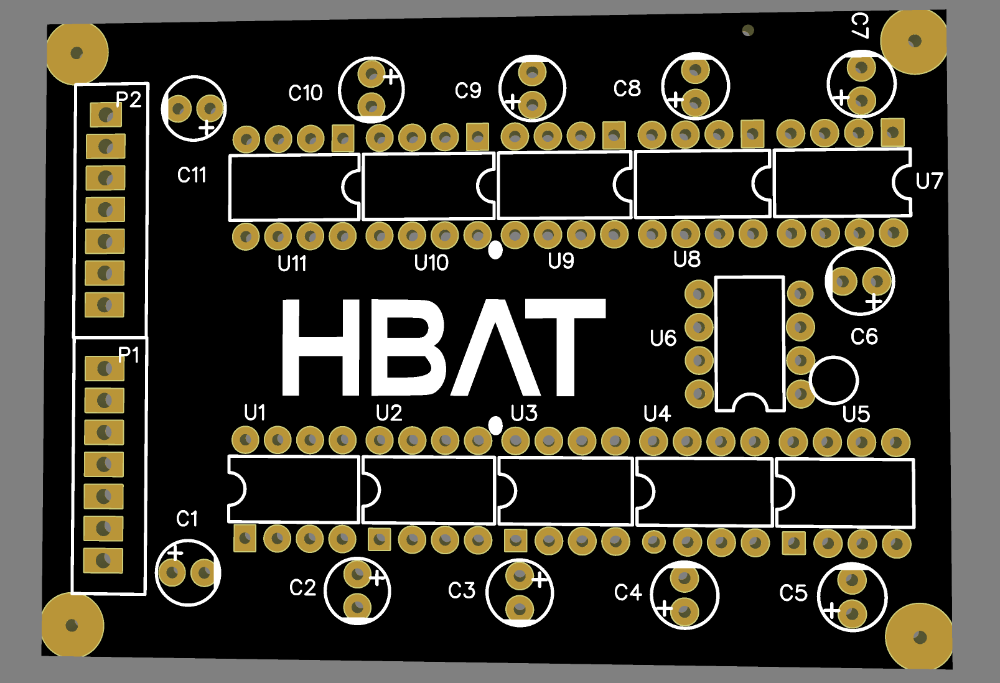
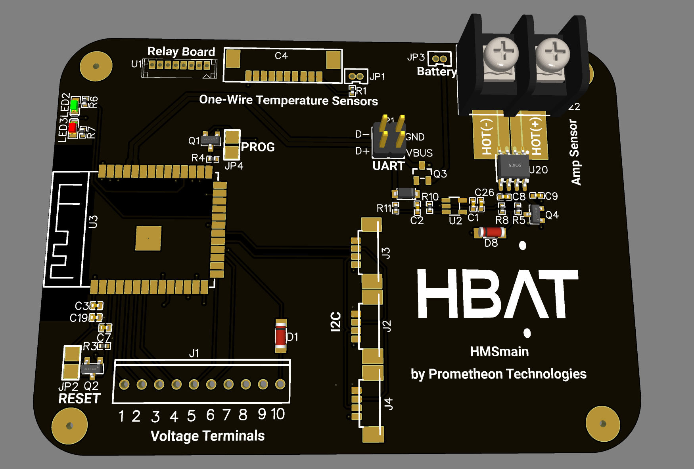
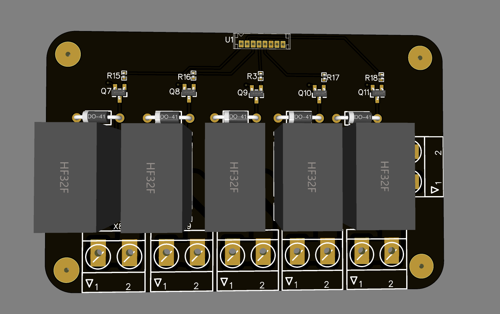

   

# Main Hardware repo for HBAT

---

## 🔹🔹 HBAT-Hardware 🔹 🔹

This repo is dedicated to the **DIY** ESP32-based *Balancing and Monitoring* circuit.

## WHAT IS THIS PROJECT

This project is the open source version of our battery BMS system. In the very early stages. If you feel like contributing, feel free to make the pull request.

## Current board Concept images

### Code

 Our Code is closed-source with publicly available builds located here: [HBAT - Software](https://github.com/Prometheon-Technologies/HBAT-Software-Public)
